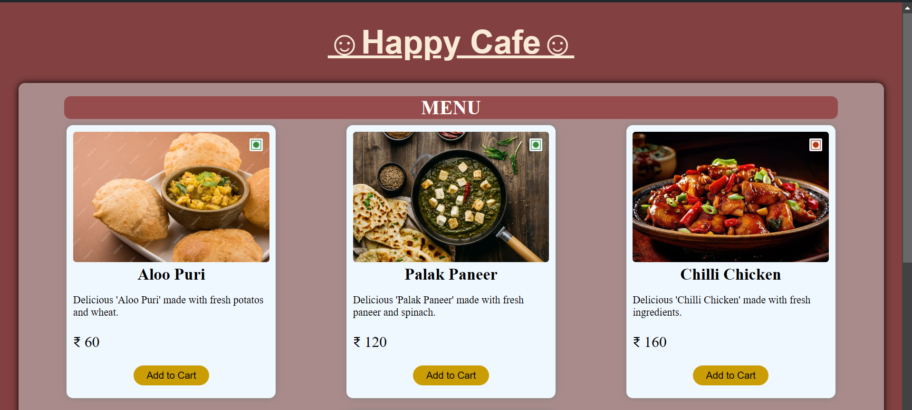

# Food Menu Application

## Overview

This is a React-based application designed to showcase a menu of food items. The `Home` component is used to display a list of food items with their images, titles, descriptions, and prices. The application also features a dynamic title and product list, which are configurable through the `data` module.

## Features

- **Dynamic Food Cards:** Displays each food item using the `FoodCard` component.
- **Configurable Title and List:** Main title and product list are dynamically set from a configuration file.
- **Responsive Design:** Styled for various screen sizes.

## Screenshot

*Above is a screenshot of the food menu in action.*
